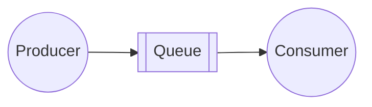
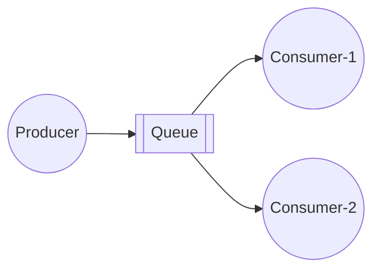
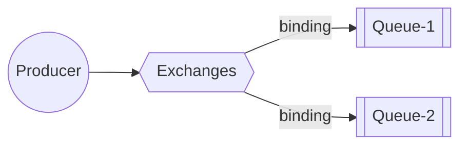
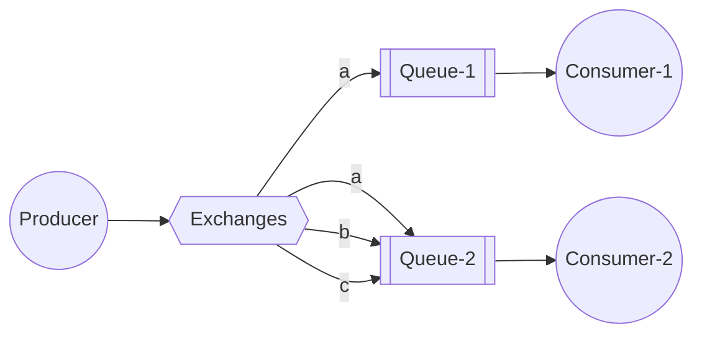
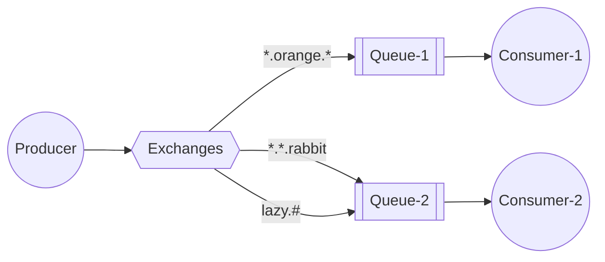
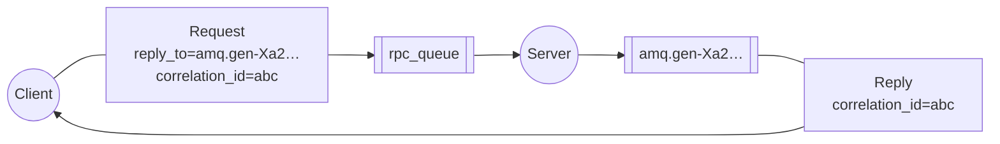

# 5. RabbitMQ Common Patterns
See https://www.rabbitmq.com/tutorials
  1. Patterns Simple Queue Hands On
  2. Patterns Work Queues  Task Queues Hands On
  3. Patterns Publish  Subscribe (fanout) Hands On
  4. Patterns Publish  Subscribe based on Routing Hands On
  5. Patterns Publish  Subscribe based on Topics Hands On
  6. Patterns Publish  Subscribe based on Headers Hands On
  7. Patterns RPC - Remote Procedure Call Hands On
## Patterns Simple Queue Hands On

* https://github.com/rabbitmq/rabbitmq-website/blob/main/src/components/Tutorials/T1DiagramToC.md
* https://github.com/rabbitmq/rabbitmq-website/blob/main/tutorials/tutorial-one-java.md
* https://www.rabbitmq.com/tutorials/tutorial-one-java
## Patterns Work Queues  Task Queues Hands On

* https://github.com/rabbitmq/rabbitmq-website/blob/main/src/components/Tutorials/T2DiagramToC.md
* https://github.com/rabbitmq/rabbitmq-website/blob/main/tutorials/tutorial-two-java.md
* https://www.rabbitmq.com/tutorials/tutorial-two-java

## Patterns Publish  Subscribe (fanout) Hands On
There are a few exchange types available: ``direct``, ``topic``, ``headers`` and ``fanout``. We'll focus on the last one:

* https://github.com/rabbitmq/rabbitmq-website/blob/main/src/components/Tutorials/T3DiagramBinding.md
* https://github.com/rabbitmq/rabbitmq-website/blob/main/tutorials/tutorial-three-java.md
* https://www.rabbitmq.com/tutorials/tutorial-three-java
## Patterns Publish  Subscribe based on **Routing** Hands On

* https://github.com/rabbitmq/rabbitmq-website/blob/main/src/components/Tutorials/T4DiagramToC.md?plain=1
* https://github.com/rabbitmq/rabbitmq-website/blob/main/tutorials/tutorial-four-java.md
* https://www.rabbitmq.com/tutorials/tutorial-four-java
## Patterns Publish  Subscribe based on **Topics** Hands On
 

* https://github.com/rabbitmq/rabbitmq-website/blob/main/src/components/Tutorials/T5DiagramTopicX.md?plain=1
* https://github.com/rabbitmq/rabbitmq-website/blob/main/tutorials/tutorial-five-java.md
* https://www.rabbitmq.com/tutorials/tutorial-five-java
## Patterns Publish  Subscribe based on **Headers** Hands On

## Patterns RPC - Remote Procedure Call Hands On

* https://github.com/rabbitmq/rabbitmq-website/blob/main/src/components/Tutorials/T6DiagramFull.md
* https://github.com/rabbitmq/rabbitmq-website/blob/main/tutorials/tutorial-six-java.md
* https://www.rabbitmq.com/tutorials/tutorial-six-java