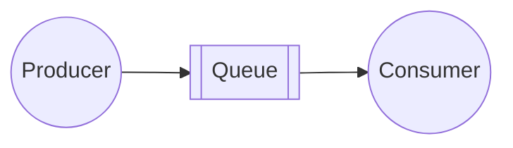
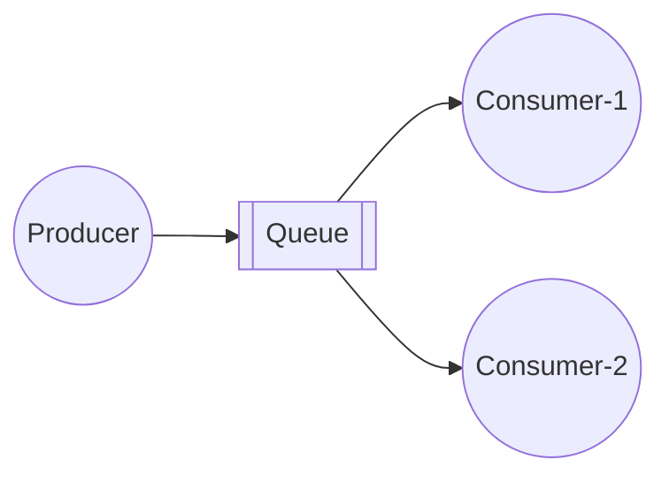
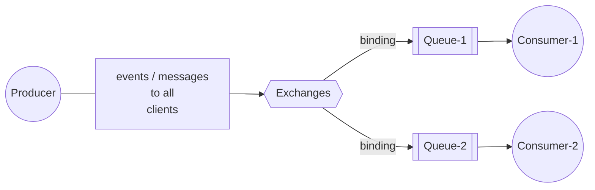
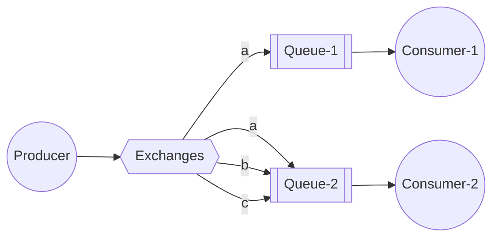
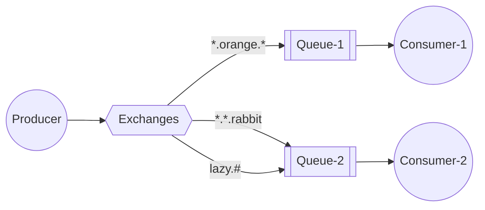
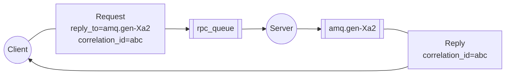

# 5. RabbitMQ Common Patterns
See https://www.rabbitmq.com/tutorials
  1. Patterns Simple Queue Hands On
  2. Patterns **Work Queues** / **Task Queues** Hands On
  3. Patterns Publish  Subscribe (fanout) Hands On
  4. Patterns Publish  Subscribe based on Routing Hands On
  5. Patterns Publish  Subscribe based on Topics Hands On
  6. Patterns Publish  Subscribe based on Headers Hands On
  7. Patterns RPC - Remote Procedure Call Hands On
## Patterns Simple Queue Hands On

* https://github.com/rabbitmq/rabbitmq-website/blob/main/src/components/Tutorials/T1DiagramToC.md
* https://github.com/rabbitmq/rabbitmq-website/blob/main/tutorials/tutorial-one-java.md
* https://www.rabbitmq.com/tutorials/tutorial-one-java
* Sample usecases:
  *  Easy code split without multithreading
  *  Connect two processes written in different technologies
* java sample code: [rabbitmq-example\src\main\java\rabbitmq\HelloExample.java](../rabbitmq-example//src/main/java/rabbitmq/HelloExample.java?plain=1#L36)
## Patterns Work Queues/Task Queues Hands On

* https://github.com/rabbitmq/rabbitmq-website/blob/main/src/components/Tutorials/T2DiagramToC.md
* https://github.com/rabbitmq/rabbitmq-website/blob/main/tutorials/tutorial-two-java.md
* https://www.rabbitmq.com/tutorials/tutorial-two-java
* Sample usecases:
  *  Distribute time-consuming tasks among multiple clients (workers)
  *  Introduce asynchronous HTTP calls to RESTful services
* Video samples:
  * Queue Name:   ``q.application1.events``
  * Publish message in ``Queue Tab``: 
    * Delivery Mode: ``2-Persistent``
    * Payload
      ```json
      {
        "message":"Hello 1"
      }
      ```
  * Get messages:
    * Ack Mode: ``Automatic ack``
    * Encoding: ``Auto string/base64``
* java sample code: [rabbitmq-example\src\main\java\rabbitmq\WorkQueueExample.java](../rabbitmq-example//src/main/java/rabbitmq/WorkQueueExample.java?plain=1#L53-L77)  
* Summary:
  *  **Round-robin dispatching**    
     Sends each message to the next consumer in a sequence
  *  **Message acknowledgment**   
     As default, message delivered into consumer is marked for deletion
  *  **No message timeouts**    
     RabbitMQ redeliver message when consumer dies
  *  **Prefetch**   
     RabbitMQ dispatches a message when it enters the queue, here we want consumer to handle one message at time
## Patterns Publish  Subscribe (fanout) Hands On
There are a few exchange types available: ``direct``, ``topic``, ``headers`` and ``fanout``. We'll focus on the last one:

* https://github.com/rabbitmq/rabbitmq-website/blob/main/src/components/Tutorials/T3DiagramBinding.md
* https://github.com/rabbitmq/rabbitmq-website/blob/main/tutorials/tutorial-three-java.md
* https://www.rabbitmq.com/tutorials/tutorial-three-java
* Sample usecases:
  * Notifications
  * Feeds
* Video samples:
  * Queue 
      * Name:   ``q.events.client1``  , ``q.events.client2``
      * Type: Classic
      * Durability: Durable
      * Auto Delete: No
  * Exchange
      * Name:   ``ex.events``
      * Type: ``fanout`` 
      * Durability: Durable
      * Auto Delete: No
      * Internal: No
  > If binding is not configured, we will see the message "Message published but not routed".
  * Bindings
      * To queue:   ``q.events.client1``  , ``q.events.client2``
  * Publish message in ``Exchange Tab``: 
    * Delivery Mode: ``2-Persistent``
    * Payload
      ```json
      {
          "message":"This is news about Sport"
      }     
  * Get messages:
    * Ack Mode: ``Automatic ack``
    * Encoding: ``Auto string/base64``
* java sample code: [rabbitmq-example\src\main\java\rabbitmq\PublishSubscribeExample.java](../rabbitmq-example//src/main/java/rabbitmq/PublishSubscribeExample.java?plain=1#L19)    
* Conclusion:   
  just broadcasts all the messages it receives to all the queues it knows - **ignores routing key** .
  We created non-durable, exclusive, autodelete queue with a generated name like: ``amq.gen-JzTY20BRgKO-HjmUJj0wLg``      
## Patterns Publish  Subscribe based on **Routing** Hands On

* https://github.com/rabbitmq/rabbitmq-website/blob/main/src/components/Tutorials/T4DiagramToC.md?plain=1
* https://github.com/rabbitmq/rabbitmq-website/blob/main/tutorials/tutorial-four-java.md
* https://www.rabbitmq.com/tutorials/tutorial-four-java
* Sample usecases:
  *  Notifications based on key
  *  Feeds based on key
## Patterns Publish  Subscribe based on **Topics** Hands On
 

* https://github.com/rabbitmq/rabbitmq-website/blob/main/src/components/Tutorials/T5DiagramTopicX.md?plain=1
* https://github.com/rabbitmq/rabbitmq-website/blob/main/tutorials/tutorial-five-java.md
* https://www.rabbitmq.com/tutorials/tutorial-five-java
## Patterns Publish  Subscribe based on **Headers** Hands On

## Patterns RPC - Remote Procedure Call Hands On

* https://github.com/rabbitmq/rabbitmq-website/blob/main/src/components/Tutorials/T6DiagramFull.md
* https://github.com/rabbitmq/rabbitmq-website/blob/main/tutorials/tutorial-six-java.md
* https://www.rabbitmq.com/tutorials/tutorial-six-java
