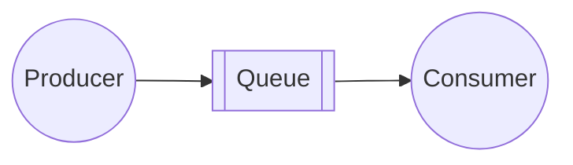
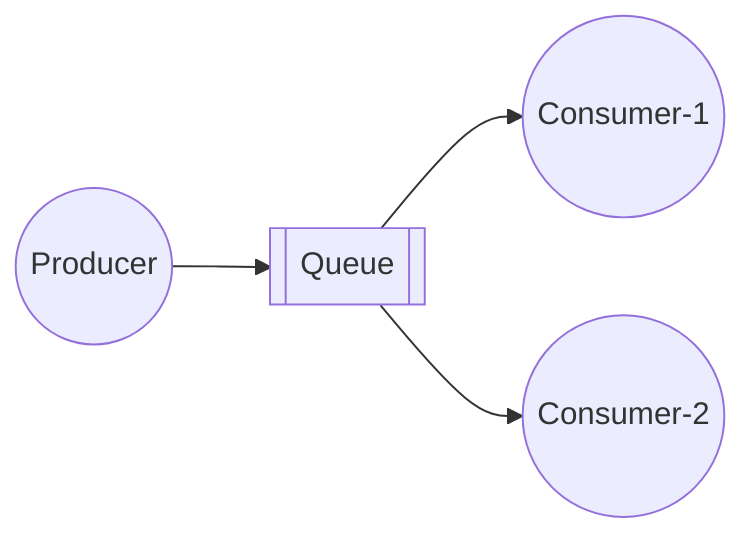
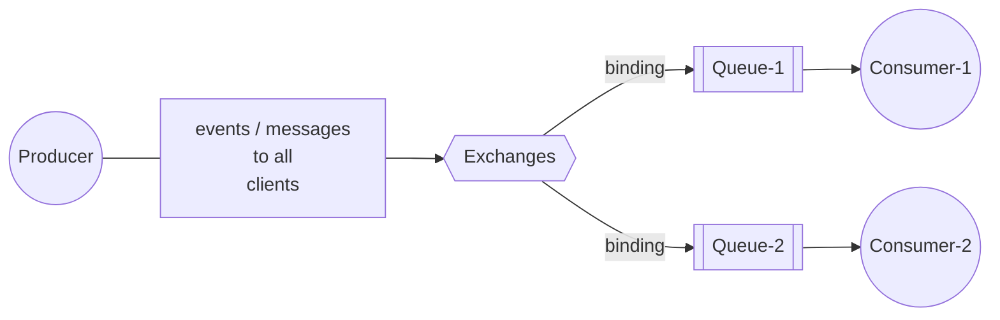
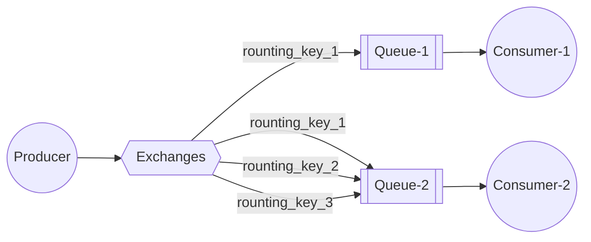
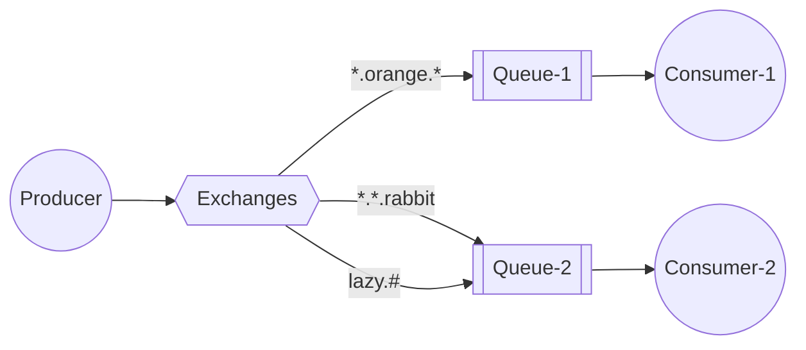
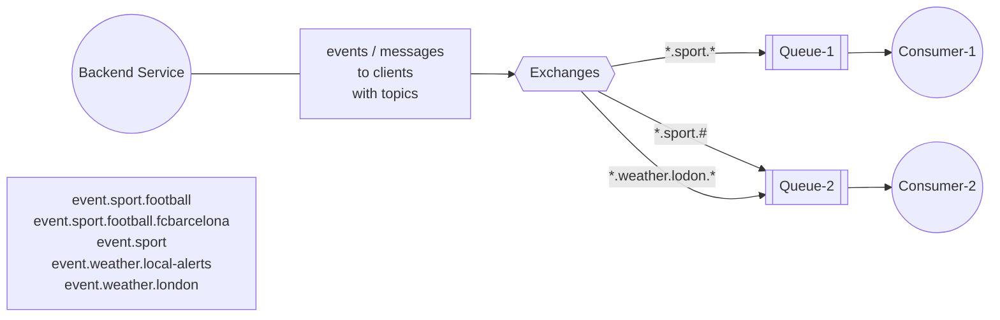
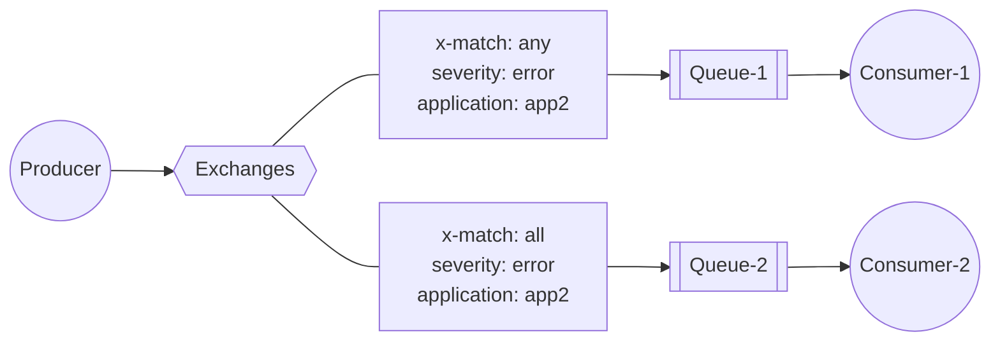
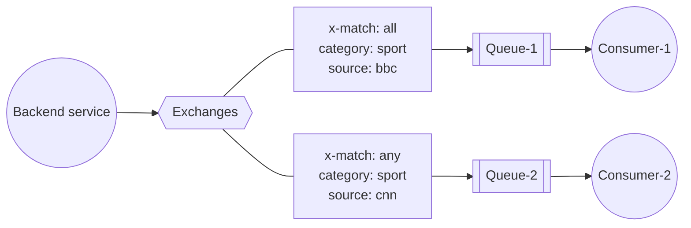
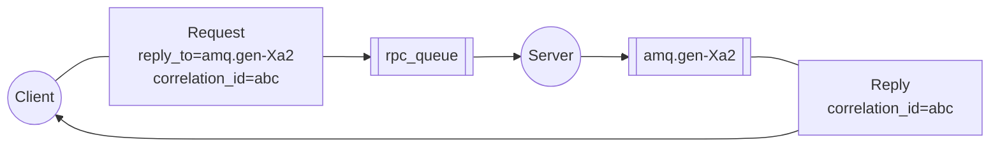

# 5. RabbitMQ Common Patterns
See https://www.rabbitmq.com/tutorials
  1. Patterns Simple Queue Hands On
  2. Patterns **Work Queues** / **Task Queues** Hands On
  3. Patterns Publish  Subscribe (fanout) Hands On
  4. Patterns Publish  Subscribe based on Routing Hands On
  5. Patterns Publish  Subscribe based on Topics Hands On
  6. Patterns Publish  Subscribe based on Headers Hands On
  7. Patterns RPC - Remote Procedure Call Hands On
## Patterns Simple Queue Hands On

* https://github.com/rabbitmq/rabbitmq-website/blob/main/src/components/Tutorials/T1DiagramToC.md
* https://github.com/rabbitmq/rabbitmq-website/blob/main/tutorials/tutorial-one-java.md
* https://www.rabbitmq.com/tutorials/tutorial-one-java
* Sample usecases:
  *  Easy code split without multithreading
  *  Connect two processes written in different technologies
* java sample code: [rabbitmq-example\src\main\java\rabbitmq\HelloExample.java](../rabbitmq-example//src/main/java/rabbitmq/HelloExample.java?plain=1#L36)
## Patterns Work Queues/Task Queues Hands On

* https://github.com/rabbitmq/rabbitmq-website/blob/main/src/components/Tutorials/T2DiagramToC.md
* https://github.com/rabbitmq/rabbitmq-website/blob/main/tutorials/tutorial-two-java.md
* https://www.rabbitmq.com/tutorials/tutorial-two-java
* Sample usecases:
  *  Distribute time-consuming tasks among multiple clients (workers)
  *  Introduce asynchronous HTTP calls to RESTful services
* Video samples:
  * Queue Name:   ``q.application1.events``
  * Publish message in ``Queue Tab``: 
    * Delivery Mode: ``2-Persistent``
    * Payload
      ```json
      {
        "message":"Hello 1"
      }
      ```
  * Get messages in ``Queue Tab``:   
    To click
* java sample code: [rabbitmq-example\src\main\java\rabbitmq\WorkQueueExample.java](../rabbitmq-example//src/main/java/rabbitmq/WorkQueueExample.java?plain=1#L53-L77)  
* Summary:
  *  **Round-robin dispatching**    
     Sends each message to the next consumer in a sequence
  *  **Message acknowledgment**   
     As default, message delivered into consumer is marked for deletion
  *  **No message timeouts**    
     RabbitMQ redeliver message when consumer dies
  *  **Prefetch**   
     RabbitMQ dispatches a message when it enters the queue, here we want consumer to handle one message at time
## Patterns Publish  Subscribe (fanout) Hands On
There are a few exchange types available: ``direct``, ``topic``, ``headers`` and ``fanout``. We'll focus on the last one:
Exchange's type is fanout.

* https://github.com/rabbitmq/rabbitmq-website/blob/main/src/components/Tutorials/T3DiagramBinding.md
* https://github.com/rabbitmq/rabbitmq-website/blob/main/tutorials/tutorial-three-java.md
* https://www.rabbitmq.com/tutorials/tutorial-three-java
* Sample usecases:
  * Notifications
  * Feeds
* Video samples:
  * Queue 
      * Name:   ``q.events.client1``  , ``q.events.client2``
      * Type: Classic
      * Durability: Durable
      * Auto Delete: No
  * Exchange
      * Name:   ``ex.events``
      * Type: ``fanout`` 
      * Durability: Durable
      * Auto Delete: No
      * Internal: No
  > If binding is not configured, we will see the message "Message published but not routed".
  * Bindings
    * Binding1:
       * To queue:   ``q.events.client1``  
       * Routing key: 
    * Binding2:
       * To queue:   ``q.events.client1``  
       * Routing key: 
  * Publish message in ``Exchange Tab``: 
    * Delivery Mode: ``2-Persistent``
    * Payload
      ```json
      {
          "message":"This is news about Sport"
      }  
      ```   
  * Get messages in ``Queue Tab``: 
    * Ack Mode: ``Automatic ack``
    * Encoding: ``Auto string/base64``
* java sample code: [rabbitmq-example\src\main\java\rabbitmq\PublishSubscribeExample.java](../rabbitmq-example//src/main/java/rabbitmq/PublishSubscribeExample.java?plain=1#L19)    
* Conclusion:   
  just broadcasts all the messages it receives to all the queues it knows - **ignores routing key** .
  We created non-durable, exclusive, autodelete queue with a generated name like: ``amq.gen-JzTY20BRgKO-HjmUJj0wLg``      
## Patterns Publish  Subscribe based on **Routing** Hands On
Exchange's type is direct.

* https://github.com/rabbitmq/rabbitmq-website/blob/main/src/components/Tutorials/T4DiagramToC.md?plain=1
* https://github.com/rabbitmq/rabbitmq-website/blob/main/tutorials/tutorial-four-java.md
* https://www.rabbitmq.com/tutorials/tutorial-four-java
* Sample usecases:
  *  Notifications based on key
  *  Feeds based on key
* java sample code: [rabbitmq-example\src\main\java\rabbitmq\RoutingExample.java](../rabbitmq-example//src/main/java/rabbitmq/RoutingExample.java?plain=1#L20-L25)     
* Video samples:
  * Queue 
      * Name:   ``q.events.client1``  , ``q.events.client2``
      * Type: Classic
      * Durability: Durable
      * Auto Delete: No
  * Exchange
      * Name:   ``ex.events``
      * Type: ``direct`` 
      * Durability: Durable
      * Auto Delete: No
      * Internal: No
  > If binding is not configured, we will see the message "Message published but not routed".
  * Bindings in Exchanges tab (``ex.events``)
    * Binding1:
       * To queue:   ``q.events.client1``  
       * Routing key: ``sport``
    * Binding2:
       * To queue:   ``q.events.client2``  
       * Routing key: ``sport`` 
    * Binding3:
       * To queue:   ``q.events.client2``  
       * Routing key: ``weather``
  * Before Test, we have to clean queue by clicking  ``Purge Message`` button  in Queue tab.   
  * Publish message   : 
    * Select ``ex.events`` in ``Exchange Tab`` in order to publish message: 
      * Test 1
        * Routing key: ``sport`` 
        * Payload
          ```json
          {
            "message":"This is Sport event"
          } 
          ```
      * Test 2
        * Routing key: ``weather`` 
        * Payload
          ```json
          {
            "message":"This is an event about incoming weather"
          } 
          ```          
  * Get messages in ``Queue Tab``: 
    * Ack Mode: ``Automatic ack``
    * Encoding: ``Auto string/base64``  
* Summary
  * Direct exchange routes to specific queue
  * Routing key is matched with binding key to route **subset of messages** to bound queues
  * Many categories of messages cause lot of bindings - it complicates administration of RabbitMQ

## Patterns Publish  Subscribe based on **Topics** Hands On 
Exchange's type is topic.

* https://github.com/rabbitmq/rabbitmq-website/blob/main/src/components/Tutorials/T5DiagramTopicX.md?plain=1
* https://github.com/rabbitmq/rabbitmq-website/blob/main/tutorials/tutorial-five-java.md
* https://www.rabbitmq.com/tutorials/tutorial-five-java
* Sample usecases:
  * Notifications based on topic 
    > Topic is a kind of routing key defined as list of words, delimited by dots.
  * Feeds based on topic
    > Binding is a simple regular expression where:
    > * ``* (star)`` can substitute exactly one word
    > * ``# (hash)`` can substitute zero or more words
* Exersise:

* java sample code: 
  * producer: [rabbitmq-example\src\main\java\rabbitmq\TopicsExample.java](../rabbitmq-example//src/main/java/rabbitmq/TopicsExample.java?plain=1#L21-L27)  
  * consumer: [rabbitmq-example\src\main\java\rabbitmq\TopicsExample.java](../rabbitmq-example//src/main/java/rabbitmq/TopicsExample.java?plain=1#L55-L68)  

* Video samples:
  * Queue 
      * Name:   ``q.events.client1``  , ``q.events.client2``
      * Type: Classic
      * Durability: Durable
      * Auto Delete: No
  * Exchange
      * Name:   ``ex.events``
      * Type: ``topic`` 
      * Durability: Durable
      * Auto Delete: No
      * Internal: No 
  > If binding is not configured, we will see the message "Message published but not routed".
  * Bindings in Exchanges tab (``ex.events``)
    * Binding1:
       * To queue:   ``q.events.client1``  
       * Routing key: ``*.sport.*``
    * Binding2:
       * To queue:   ``q.events.client2``  
       * Routing key: ``*.sport.#``       
    * Binding3:
       * To queue:   ``q.events.client2``  
       * Routing key: ``*.weather.london.*`` 
  * Before Test, we have to clean queue by clicking  ``Purge Message`` button  in Queue tab.   
  * Publish message   : 
    * Select ``ex.events`` in ``Exchange Tab`` in order to publish message: 
        | Routing key            | Client #1 | Client #2 |
        |------------------------|-----------|-----------|
        | event.sport            |   -       |     √     |
        | event.sport.ruby.news  |   -       |     √     |
        | event.sport.football   |   √       |     √     |
        | event.sport.today-news |   √       |     √     |
      * Test 1
        * Routing key: ``event.sport`` 
        * Payload
          ```json
          {
            "message":"Sport event"
          } 
          ```        
      * Test 2
        * Routing key: ``event.sport.football`` 
        * Payload
          ```json
          {
            "message":"Football event"
          } 
          ```    
      * Test 3
        * Routing key: ``event.sport.football.barcelona`` 
        * Payload
          ```json
          {
            "message":"This is event about Barcelona"
          } 
          ```    
      * Test 4
        * Routing key: ``event.weather.local-alerts`` 
        * Payload
          ```json
          {
            "message":"Local alert about the storm"
          } 
          ``` 
      * Test 5
        * Routing key: ``event.weather.london.local`` 
        * Payload
          ```json
          {
            "message":"Local weather in London"
          } 
          ``` 
      * Test 6
        * Routing key: ``event.weather.london.alerts`` 
        * Payload
          ```json
          {
            "message":"Local weather in London"
          } 
          ``` 
      * Test 7
        * Routing key: ``event.weather.london.london-city`` 
        * Payload
          ```json
          {
            "message":"Local weather in London"
          } 
          ```     
  * Get messages in ``Queue Tab``: 
    * Ack Mode: ``Automatic ack``
    * Encoding: ``Auto string/base64``  
* Summary
  * **Topic limit is 255 characters**   
    List of words, delimited by dots
  * **No words limit**   
    A word can be any string; should specify features hierarchy
  * **Substitutions**   
    * ``* (star)`` exactly one word
    * ``# (hash)`` zero or more words
> Define topic names wisely! - Topic must represent a hierarchy, i.e.:
> **event.weather.south-east.london**

## Patterns Publish  Subscribe based on **Headers** Hands On
Exchange's type is header.

* Sample usecases:
  * Notifications based on header
  * Feeds based on header
    > headers beginning with the string **x-** are not used to evaluate matches
* Exersise:    

* java sample code: 
  * producer: [rabbitmq-example\src\main\java\rabbitmq\HeadersExample.java](../rabbitmq-example//src/main/java/rabbitmq/HeadersExample.java?plain=1#L24-L34)  
  * consumer: [rabbitmq-example\src\main\java\rabbitmq\HeadersExample.java](../rabbitmq-example//src/main/java/rabbitmq/HeadersExample.java?plain=1#L75-L93)

* Video samples:
  * Queue 
      * Name:   ``q.events.client1``  , ``q.events.client2``
      * Type: Classic
      * Durability: Durable
      * Auto Delete: No
  * Exchange
      * Name:   ``ex.events``
      * Type: ``headers`` 
      * Durability: Durable
      * Auto Delete: No
      * Internal: No 
  > If binding is not configured, we will see the message "Message published but not routed".
  * Bindings in Exchanges tab (``ex.events``)
    * Binding1:
       * To queue:   ``q.events.client1``  
       * Routing key: 
       * Arguments:
         * x-match = all
         * category = sport
         * source = bbc
    * Binding2:
       * To queue:   ``q.events.client2``  
       * Routing key: 
       * Arguments:
         * x-match = any
         * category = sport
         * source = cnn 
  * Before Test, we have to clean queue by clicking  ``Purge Message`` button  in Queue tab.   
  * Publish message   : 
    * Select ``ex.events`` in ``Exchange Tab`` in order to publish message: 
      * Test 1
        * Routing key: 
        * Headers:
          * category = sport
          * source = nytimes
        * Payload
          ```json
          {
            "message":"This is sport event"
          } 
          ```        
      * Test 2
        * Routing key: 
        * Headers:
          * category = sport
          * source = bbc
        * Payload
          ```json
          {
            "message":"This is sport event from BBC"
          } 
          ```
      * Test 3
        * Routing key: 
        * Headers:
          * category = weather
          * source = cnn
        * Payload
          ```json
          {
            "message":"Weather from CNN"
          } 
          ```               
  * Get messages in ``Queue Tab``: 
    * Ack Mode: ``Automatic ack``
    * Encoding: ``Auto string/base64``  
* Summary
  * **Uses headers from AMQP message structure**   
    Key -> value pairs
  * **No substitutions**   
    Header must exactly match to the list of headers defined in the binding
  * **Ignores routing key**   
    Like fanout exchange, headerds exchange ignores routing key
  * **More flexible than direct exchange**   
    But sometimes harder to maintain
> headers beginning with the string **x-** are not used to evaluate matches

## Patterns RPC - Remote Procedure Call Hands On

* https://github.com/rabbitmq/rabbitmq-website/blob/main/src/components/Tutorials/T6DiagramFull.md
* https://github.com/rabbitmq/rabbitmq-website/blob/main/tutorials/tutorial-six-java.md
* https://www.rabbitmq.com/tutorials/tutorial-six-java
* Sample usecases:
  * Out of the box RPC implementation
  * Distribute tasks among multiple clients (workers) - and wait for result
* java sample code: 
  * RPC Client (producer): [rabbitmq-example\src\main\java\rabbitmq\RPCExample.java](../rabbitmq-example//src/main/java/rabbitmq/RPCExample.java?plain=1#L37-L61)  
  * RPC Server (consumer): [rabbitmq-example\src\main\java\rabbitmq\RPCExample.java](../rabbitmq-example//src/main/java/rabbitmq/RPCExample.java?plain=1#L111-L148)

* RPC - Remote Procedure Call
  * **RabbitMQ can be used a nice RPC wrapper**
    * Any RPC implementation based on queues is fine, here we have an API out of the box
  * **Single queue**
    * Requests and responses goes through single queue; 
    * both matched by **correlationId** property,
    > CorrelationID is one of 14 messages properties defined in AMQP 0-9-1 protocol (like deliveryMode, replyTo, contentType etc.
  * **General RPC good habits**
    * Make a clear comment in the code that function call is local or remote,
    * Keep up-to-date documentation about dependencies between components,
    * Handle communication issues, i.e. when RPC server is down; 
      * Scale-out RPC service by combining RPC pattern with Work Queues or more sophisticated exchanges like consistent hash, and so on