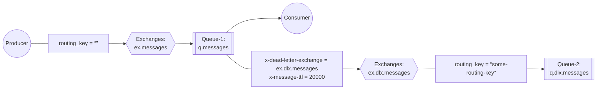
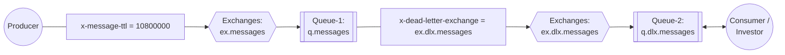

# 5. RabbitMQ Advance 
See https://www.rabbitmq.com/tutorials
  1. Custom Exchanges - Consistent Hash Exchange
  2. Dead Letter Exchange (DLX)
  3. Delay Schedule, Delay Publication Model.
  4. Data safety - Transactions & Publisher Confirms
  5. Vhosts
  6. Policies
  7. Lazy queues - memory optimization
  8. Priority Queues
  9. NT service   
## Custom Exchanges - Consistent Hash Exchange
### Purpose
The purpose of this exchange type is to help developers achieve a reasonably even message flow distribution between a number of queues.
#### Sample usecases:
  *  plit long queue into smaller ones
  *  Distribute logically related messages across many queues (to reduce latency from the consumer’s perspective and increase reliability)
#### Installation
This plugin ships with RabbitMQ.

#### Enabling the Plugin
This plugin ships with RabbitMQ. Like all other RabbitMQ plugins, it has to be enabled before it can be used:
* in Mac or Linux
   ```bash
   rabbitmq-plugins enable rabbitmq_consistent_hash_exchange
   ```
* in Windows
   ```cmd
   > cd %RABBITMQ%\rabbitmq_server-3.12.13\sbin
   > set ERLANG_HOME=c:\Program Files\erl-25.3.2.9
   > rabbitmq-plugins.bat enable rabbitmq_consistent_hash_exchange
   ```
* in Docker (https://hub.docker.com/_/rabbitmq)
  *  Creating a Dockerfile will have them enabled at runtime. To see the full list of plugins present on the image 
     ```bash
     $ winpty docker exec -it rabbitmq bash
     rabbitmq-plugins list

     Listing plugins with pattern ".*" ...
      Configured: E = explicitly enabled; e = implicitly enabled
      | Status: * = running on rabbit@Shulin-2023
      |/
     [  ] rabbitmq_amqp1_0                  3.12.13
     [  ] rabbitmq_auth_backend_cache       3.12.13
     [  ] rabbitmq_auth_backend_http        3.12.13
     [  ] rabbitmq_auth_backend_ldap        3.12.13
     [  ] rabbitmq_auth_backend_oauth2      3.12.13
     [  ] rabbitmq_auth_mechanism_ssl       3.12.13
     [  ] rabbitmq_consistent_hash_exchange 3.12.13
     [  ] rabbitmq_event_exchange           3.12.13
     [  ] rabbitmq_federation               3.12.13
     [  ] rabbitmq_federation_management    3.12.13
     [  ] rabbitmq_jms_topic_exchange       3.12.13
     [E*] rabbitmq_management               3.12.13
     [e*] rabbitmq_management_agent         3.12.13
     [  ] rabbitmq_mqtt                     3.12.13
     [  ] rabbitmq_peer_discovery_aws       3.12.13
     [  ] rabbitmq_peer_discovery_common    3.12.13
     [  ] rabbitmq_peer_discovery_consul    3.12.13
     [  ] rabbitmq_peer_discovery_etcd      3.12.13
     [  ] rabbitmq_peer_discovery_k8s       3.12.13
     [E*] rabbitmq_prometheus               3.12.13
     [  ] rabbitmq_random_exchange          3.12.13
     [  ] rabbitmq_recent_history_exchange  3.12.13
     [  ] rabbitmq_sharding                 3.12.13
     [  ] rabbitmq_shovel                   3.12.13
     [  ] rabbitmq_shovel_management        3.12.13
     [  ] rabbitmq_stomp                    3.12.13
     [  ] rabbitmq_stream                   3.12.13
     [  ] rabbitmq_stream_management        3.12.13
     [  ] rabbitmq_top                      3.12.13
     [  ] rabbitmq_tracing                  3.12.13
     [  ] rabbitmq_trust_store              3.12.13
     [e*] rabbitmq_web_dispatch             3.12.13
     [  ] rabbitmq_web_mqtt                 3.12.13
     [  ] rabbitmq_web_mqtt_examples        3.12.13
     [  ] rabbitmq_web_stomp                3.12.13
     [  ] rabbitmq_web_stomp_examples       3.12.13
     ```
     ```Dockerfile
     FROM rabbitmq:3.12-management
     RUN rabbitmq-plugins enable --offline  rabbitmq_consistent_hash_exchange
     ```
  *  You can also mount a file at /etc/rabbitmq/enabled_plugins with contents as an erlang list of atoms ending with a period.
     ```bash
     Example enabled_plugins
     [rabbitmq_federation_management,rabbitmq_management,rabbitmq_mqtt,rabbitmq_stomp].      
     ```
* in Docker Compose (https://docs.docker.com/compose/install/standalone/)   
  * in podman machine:
    ```bash
    docker build -t  rabbitmq:3.12.13-custom enable-plugins\
    docker compose -f docker-compose-with-plugins.yml up -d
    ``` 
  * in linux
    ```bash
    docker compose -f docker-compose-with-plugins.yml build 
    docker compose -f docker-compose-with-plugins.yml up -d
    ```  
#### Provided Exchange Type
The exchange type is "x-consistent-hash".  
### Official Documentation
  * https://github.com/rabbitmq/rabbitmq-server/tree/main/deps/rabbitmq_consistent_hash_exchange
  * https://en.wikipedia.org/wiki/Consistent_hashing
### java sample code
* Video operations:
  * Check whether the "x-consist-hash" exchange type is added to the types in the "Exchange" tab.
  * Queue 
      * Name:   ``q.message1``  , ``q.message2``
      * Type: Classic
      * Durability: Durable
      * Auto Delete: No
  * Exchange
      * Name:   ``ex.hash``
      * Type: ``x-consistent-hash`` 
      * Durability: Durable
      * Auto Delete: No
      * Internal: No
  > If binding is not configured, we will see the message "Message published but not routed".
  * Bindings in the "Exchange" tab ``ex.hash``
    * Binding1:
       * To queue:   ``q.message1``
       * Routing key: ``1``
    > If routing key is not configured, we will see the message "The binding key must be an integer: <<>>".   
    * Binding2:
       * To queue:   ``q.message2``  
       * Routing key:  ``1``
  * Publish message in  ``ex.hash`` of ``Exchange Tab``: 
    * 1st
      * Routing key:  
      * Payload:
        ```text
        Hello world
        ```
    * 2nd
      * Routing key: ``11``
      * Payload:
        ```text
        Hello world
        ```
    * 3rd
      * Routing key: ``44``
      * Payload:
        ```text
        Hello world
        ```
    * 4th
      * Routing key: ``11``
      * Payload:
        ```text
        Hello world
        ```    
    * 5th
      * Routing key: ``1122``
      * Payload:
        ```text
        Hello world
        ```
    * 6th
      * Routing key: ``6``
      * Payload:
        ```text
        Hello world
        ```          
  * Execute [rabbitmq-example\src\main\java\rabbitmq\ConsistentHashPublish.java](../rabbitmq-example//src/main/java/rabbitmq/ConsistentHashPublish.java?plain=1#L16-L36)        
  * Get messages in ``Queue Tab``: 
    * Ack Mode: ``Automatic ack``
    * Encoding: ``Auto string/base64``
  * Purge messages in ``Queue Tab``: 
  * Re-Bindings in the "Exchange" tab ``ex.hash``
    * Un-binding Binding2:
       * Un-binding to queue:   ``q.message2``
       * Routing key: ``1``
    * Binding2: ``q.message2 with binding key = 2``
       * To queue:   ``q.message2``  
       * Routing key:  ``2`` 
  * Re-Execute [rabbitmq-example\src\main\java\rabbitmq\ConsistentHashPublish.java](../rabbitmq-example//src/main/java/rabbitmq/ConsistentHashPublish.java?plain=1#L16-L36)             
## Dead Letter Exchange (DLX)
* see https://rabbitmq-website.pages.dev/docs/dlx
* Messages from the queue can be dead-lettered when:
  * **Message is negatively (ack)nowledged**   
    When Nack or Reject with requeue=false is called
  * **TTL expired**   
    When message expires due to per-message TTL,
  * **Message is dropped**   
    Queue exceeded length limit

```bash
> rabbitmqctl set_policy DLX ".*" "{""dead-letter-exchange"":""my-dlx""}" --apply-to queues
```
### Delay retry/schedule with DLX - Producer
see [rabbitmq-example\src\main\java\rabbitmq\DeadLetterExample.java](../rabbitmq-example//src/main/java/rabbitmq/DeadLetterExample.java?plain=1#L47-L65)        
### Delay retry/schedule with DLX - Consumer
see [rabbitmq-example\src\main\java\rabbitmq\DeadLetterExample.java](../rabbitmq-example//src/main/java/rabbitmq/DeadLetterExample.java?plain=1#L81-L96)    
### DLX example: Hands-On
1. Create a DLX exchange
2. Create a DLX queue
3. Bind DLX exchange with DLX queue
4. Create an exchange to be used by publisher
5. Create queue with x-dead-letter-exchange attribute
6. Bind them

* Excerise 

* Video operations: 
  * Queue2 
      * Name:   ``q.dlx.messages``
      * Type: Classic
      * Durability: Durable
      * Auto Delete: No
  * Exchange2
      * Name:   ``ex.dlx.messages``
      * Type: ``direct`` 
      * Durability: Durable
      * Auto Delete: No
      * Internal: No
  > If binding is not configured, we will see the message "Message published but not routed".
  * Bindings in the "Exchange" tab ``ex.dlx.messages``
    * Binding1:
       * To queue:   ``q.dlx.messages``
       * Routing key: 
  * Queue1 
      * Name:   ``q.messages``
      * Type: Classic
      * Durability: Durable
      * Auto Delete: No
      * Arguments: 
        * x-dead-letter-exchange = ex.dlx.messages  String
        * x-message-ttl = 20000 Number
  * Exchange1
      * Name:   ``ex.messages``
      * Type: ``direct`` 
      * Durability: Durable
      * Auto Delete: No
      * Internal: No
  * Bindings in the "Exchange" tab ``ex.messages``
    * Binding2:
       * To queue:   ``q.messages``
       * Routing key:       
  * Publish message in  ``ex.messages`` of ``Exchange Tab``: 
    * 1st
      * Routing key:  
      * Payload:
        ```text
        Hello world
        ```
  * Waiting for 20 seconds to see the change of q.dlx.messages amount ( 0 -> 1 )
  * Get messages in  ``q.dlx.messages`` of ``Queue Tab``: 
    * Ack Mode: ``Nack message requeue true``
    * Encoding: ``Auto string/base64``
    * Messages: ``1``
  * Get messages in  ``q.messages`` of ``Queue Tab``: 
    * Ack Mode: ``Reject requeue false``
    * Encoding: ``Auto string/base64``
    * Messages: ``1``
  * Publish message in  ``ex.messages`` of ``Exchange Tab``: 
    * 2nd
      * Routing key:  
      * Payload:
        ```text
        Hello world 2
        ```
  * Waiting for 20 seconds to see the change of q.dlx.messages amount ( 1 -> 2 )
  * Get messages in  ``q.dlx.messages`` of ``Queue Tab``: 
    * Ack Mode: ``Nack message requeue true``
    * Encoding: ``Auto string/base64``
    * Messages: ``10``        
### Spring-boot
* Error Handling with Spring AMQP: https://www.baeldung.com/spring-amqp-error-handling    
## Delay Schedule, Delay Publication Model.
* When to use
  * **No need or forbidden to consume messages immediately**   
    Publish messages, but allow consumers to consume them after 3:00 PM Friday after conference press
  * **Automatic retrying**   
    Rejected message to be resend again in about 10 minutes
  * **Delay and “batch” publication**   
    Intentional latency increase between publisher and consumer or group messages into bigger batches
  > Consider simple solutions over installing additional plugins like rabbitmq-delayed-message-exchange.    
  > Such plugins store messages in mnesia table, which is not designed to store high volume of 
the data

  * Publication at - 1:00 PM
* Press conference starts - 3:00 PM
* Press conference ends - 4:00 PM
* TTL = 10 800 seconds
### Delay retry/schedule with DLX - Retry consumer
* see [rabbitmq-example\src\main\java\rabbitmq\DeadLetterExample.java](../rabbitmq-example//src/main/java/rabbitmq/DeadLetterExample.java?plain=1#L117-L132)  
* see [rabbitmq-example\src\main\java\rabbitmq\CircularDeadLetterExample.java](../rabbitmq-example//src/main/java/rabbitmq/CircularDeadLetterExample.java?plain=1#L115-L126)  
> RabbitMQ has no support for delayed/scheduled messages. Feature can be used when:
>  - there is no need to read messages immediately,
>  - message I read can't be processed or I want to requeue it and try again in about 10 minutes
> - group messages into batches or reduce consumer’s load
```bash
-> Running producer
[x] Sent 'Hello World 0'
--> Running consumer for rejected messages
[*] Waiting for rejected messages....
[x] Sent 'Hello World 1'
[x] Sent 'Hello World 2'
[x] Sent 'Hello World 3'
--> Running consumer
[*] Waiting for messages....
[x] Rejecting 'Hello World 0' with routingKey=
[x] Rejecting 'Hello World 1' with routingKey=
[x] Rejecting 'Hello World 2' with routingKey=
[x] Rejecting 'Hello World 3' with routingKey=
[x] Received rejected message: 'Hello World 0' with routingKey=some-routing-key (reason=rejected)
[x] Received rejected message: 'Hello World 1' with routingKey=some-routing-key (reason=rejected)
[x] Received rejected message: 'Hello World 2' with routingKey=some-routing-key (reason=rejected)
[x] Received rejected message: 'Hello World 3' with routingKey=some-routing-key (reason=rejected)
[x] Sent 'Hello World 4'
[x] Rejecting 'Hello World 4' with routingKey=
[x] Received rejected message: 'Hello World 4' with routingKey=some-routing-key (reason=rejected)
--> Closing consumer
--> Consumer closed
[x] Sent 'Hello World 5'
[x] Sent 'Hello World 6'
[x] Received rejected message: 'Hello World 5' with routingKey=some-routing-key (reason=expired)
[x] Received rejected message: 'Hello World 6' with routingKey=some-routing-key (reason=expired)
```
## Data safety - Transactions & Publisher Confirms

### Data safety
* Acknowledgements on both consumer and publisher side are important for data safety
    * **Consumer Acknowledgment**  → Defaults: Auto Ack
      * One of **ACK**, **nACK** (RabbitMQ extension for Reject to reject multiple messages at once), 
      * **Reject** (defined in AMQP protocol)  

       | ACK             | - Positive acknowledgment                    | → remove message from the queue  |
       |-----------------|----------------------------------------------|----------------------------------|
       | nACK or Reject  | - Negative acknowledgment with requeue=true  | → keep message in the queue      |
       | nACK or Reject  | - Negative acknowledgment with requeue=false | → remove message from the queue  |
    * **Transactions (tx)** → Defaults: Disabled
      * Safe batching feature (remember: batching Acks)
    * **Publisher Confirms** → Defaults: Disabled
      * Broker to send confirmation once message is safety stored (RabbitMQ feature)
* see [rabbitmq-example\src\main\java\rabbitmq\TransactionsExample.java](../rabbitmq-example//src/main/java/rabbitmq/TransactionsExample.java?plain=1#L79-L90)  
* see [rabbitmq-example\src\main\java\rabbitmq\TransactionsExample2.java](../rabbitmq-example//src/main/java/rabbitmq/TransactionsExample2.java?plain=1#L104-L119)  
### Transactions
> **Transactions decrease performance**. Overall throughput is decreased by factor close to 250. Consider “publisher confirms” or smart acknowledgments implementation .
### Transactions (tx) - batch
Transactions in RabbitMQ are closer to batching feature than ACID concept.
* **txSelect**  
  - set channel to use transactions. Method must be called at least once before calling txCommit or txRollback.
* **txCommit/txRollback** 
  - commits/rollbacks all message publications and (ack)nowledgments performed in current transaction
* see [rabbitmq-example\src\main\java\rabbitmq\TransactionsExample.java](../rabbitmq-example//src/main/java/rabbitmq/TransactionsExample.java?plain=1#L57-L69)
> **Transactions decrease performance**; consider “publisher confirms” or smart acknowledgments implementation.
### Publisher Confirms
see https://www.rabbitmq.com/docs/confirms

Publisher confirms is a RabbitMQ extension to implement reliable publishing (not enabled by default). To make sure published messages have safely reached the broker.

Both type of acknowledgments are essential for **data safety**

> Better than transactions - transactions can decrease throughput **by hundreds of times**
* see [rabbitmq-example\src\main\java\rabbitmq\TransactionsExample.java](../rabbitmq-example//src/main/java/rabbitmq/TransactionsExample.java?plain=1#L35-L49)
> Ack is when all queues accepted the message and message is saved on the disk (persistent, durable mode)

> Performance warning! Run example code and note:
> * Published 50,000 messages in **1,768 ms**
> * Published 50,000 messages in **14,218 ms**
> * Published 50,000 messages in batch in **2,798 ms**
> * Published 50,000 messages and handled confirms asynchronously in **1,786 ms**

> Performance warning! Run example code and note:
>
> | (no confirms)            | Published 50,000 messages in 1,768 ms                                      |
> |--------------------------|----------------------------------------------------------------------------|
> | (confirms every message) | Published 50,000 messages in 14,218 ms                                     |
> | (confirms in batch)      | Published 50,000 messages in batch in 2,798 ms   |
> | (confirms in batch)      | Published 50,000 messages and handled confirms asynchronously in 1,786 ms |
### Data safety - summary
* To make sure your system is reliable and to avoid losing messages due to any unpredicted network issues
  * **Durable queue, durable exchange and persistent messages**
    * To survive accidental RabbitMQ restart or failure
  * **Consumer to manually confirm** 
    * Default mode is an automatic ACK
  * **Transactions (tx)**
    * Use transactions only when set of messages must be delivered as a package (all or nothing) and there is no way to send them as a single message (degraded overall throughput by factor of 250)
  * **Publisher Confirms**
    * Enable confirm mode and retry in case of nAck returned by RabbitMQ
> **Publisher Confirms** - wait asynchronously on confirmations to don’t impact on throughput more than needed
* see [rabbitmq-example\src\main\java\rabbitmq\PublisherConfirmsExample.java](../rabbitmq-example//src/main/java/rabbitmq/PublisherConfirmsExample.java?plain=1#L142-L149)

## Vhosts
## Policies
## Lazy queues - memory optimization
## Priority Queues
## NT service