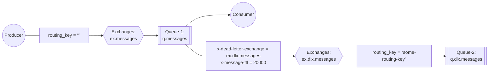

# 5. RabbitMQ Advance 
See https://www.rabbitmq.com/tutorials
  1. Custom Exchanges - Consistent Hash Exchange
  2. Dead Letter Exchange (DLX)
  3. Delay Schedule, Delay Publication Model.
  4. Data safety - Transactions & Publisher Confirms
  5. Vhosts
  6. Policies
  7. Lazy queues - memory optimization
  8. Priority Queues
  9. NT service   
## Custom Exchanges - Consistent Hash Exchange
### Purpose
The purpose of this exchange type is to help developers achieve a reasonably even message flow distribution between a number of queues.
#### Sample usecases:
  *  plit long queue into smaller ones
  *  Distribute logically related messages across many queues (to reduce latency from the consumer’s perspective and increase reliability)
#### Installation
This plugin ships with RabbitMQ.

#### Enabling the Plugin
This plugin ships with RabbitMQ. Like all other RabbitMQ plugins, it has to be enabled before it can be used:
* in Mac or Linux
   ```bash
   rabbitmq-plugins enable rabbitmq_consistent_hash_exchange
   ```
* in Windows
   ```cmd
   > cd %RABBITMQ%\rabbitmq_server-3.12.13\sbin
   > set ERLANG_HOME=c:\Program Files\erl-25.3.2.9
   > rabbitmq-plugins.bat enable rabbitmq_consistent_hash_exchange
   ```
* in Docker (https://hub.docker.com/_/rabbitmq)
  *  Creating a Dockerfile will have them enabled at runtime. To see the full list of plugins present on the image 
     ```bash
     $ winpty docker exec -it rabbitmq bash
     rabbitmq-plugins list

     Listing plugins with pattern ".*" ...
      Configured: E = explicitly enabled; e = implicitly enabled
      | Status: * = running on rabbit@Shulin-2023
      |/
     [  ] rabbitmq_amqp1_0                  3.12.13
     [  ] rabbitmq_auth_backend_cache       3.12.13
     [  ] rabbitmq_auth_backend_http        3.12.13
     [  ] rabbitmq_auth_backend_ldap        3.12.13
     [  ] rabbitmq_auth_backend_oauth2      3.12.13
     [  ] rabbitmq_auth_mechanism_ssl       3.12.13
     [  ] rabbitmq_consistent_hash_exchange 3.12.13
     [  ] rabbitmq_event_exchange           3.12.13
     [  ] rabbitmq_federation               3.12.13
     [  ] rabbitmq_federation_management    3.12.13
     [  ] rabbitmq_jms_topic_exchange       3.12.13
     [E*] rabbitmq_management               3.12.13
     [e*] rabbitmq_management_agent         3.12.13
     [  ] rabbitmq_mqtt                     3.12.13
     [  ] rabbitmq_peer_discovery_aws       3.12.13
     [  ] rabbitmq_peer_discovery_common    3.12.13
     [  ] rabbitmq_peer_discovery_consul    3.12.13
     [  ] rabbitmq_peer_discovery_etcd      3.12.13
     [  ] rabbitmq_peer_discovery_k8s       3.12.13
     [E*] rabbitmq_prometheus               3.12.13
     [  ] rabbitmq_random_exchange          3.12.13
     [  ] rabbitmq_recent_history_exchange  3.12.13
     [  ] rabbitmq_sharding                 3.12.13
     [  ] rabbitmq_shovel                   3.12.13
     [  ] rabbitmq_shovel_management        3.12.13
     [  ] rabbitmq_stomp                    3.12.13
     [  ] rabbitmq_stream                   3.12.13
     [  ] rabbitmq_stream_management        3.12.13
     [  ] rabbitmq_top                      3.12.13
     [  ] rabbitmq_tracing                  3.12.13
     [  ] rabbitmq_trust_store              3.12.13
     [e*] rabbitmq_web_dispatch             3.12.13
     [  ] rabbitmq_web_mqtt                 3.12.13
     [  ] rabbitmq_web_mqtt_examples        3.12.13
     [  ] rabbitmq_web_stomp                3.12.13
     [  ] rabbitmq_web_stomp_examples       3.12.13
     ```
     ```Dockerfile
     FROM rabbitmq:3.12-management
     RUN rabbitmq-plugins enable --offline  rabbitmq_consistent_hash_exchange
     ```
  *  You can also mount a file at /etc/rabbitmq/enabled_plugins with contents as an erlang list of atoms ending with a period.
     ```bash
     Example enabled_plugins
     [rabbitmq_federation_management,rabbitmq_management,rabbitmq_mqtt,rabbitmq_stomp].      
     ```
* in Docker Compose (https://docs.docker.com/compose/install/standalone/)   
  * in podman machine:
    ```bash
    docker build -t  rabbitmq:3.12.13-custom enable-plugins\
    docker compose -f docker-compose-with-plugins.yml up -d
    ``` 
  * in linux
    ```bash
    docker compose -f docker-compose-with-plugins.yml build 
    docker compose -f docker-compose-with-plugins.yml up -d
    ```  
#### Provided Exchange Type
The exchange type is "x-consistent-hash".  
### Official Documentation
  * https://github.com/rabbitmq/rabbitmq-server/tree/main/deps/rabbitmq_consistent_hash_exchange
  * https://en.wikipedia.org/wiki/Consistent_hashing
### java sample code
* Video operations:
  * Check whether the "x-consist-hash" exchange type is added to the types in the "Exchange" tab.
  * Queue 
      * Name:   ``q.message1``  , ``q.message2``
      * Type: Classic
      * Durability: Durable
      * Auto Delete: No
  * Exchange
      * Name:   ``ex.hash``
      * Type: ``x-consistent-hash`` 
      * Durability: Durable
      * Auto Delete: No
      * Internal: No
  > If binding is not configured, we will see the message "Message published but not routed".
  * Bindings in the "Exchange" tab ``ex.hash``
    * Binding1:
       * To queue:   ``q.message1``
       * Routing key: ``1``
    > If routing key is not configured, we will see the message "The binding key must be an integer: <<>>".   
    * Binding2:
       * To queue:   ``q.message2``  
       * Routing key:  ``1``
  * Publish message in  ``ex.hash`` of ``Exchange Tab``: 
    * 1st
      * Routing key:  
      * Payload:
        ```text
        Hello world
        ```
    * 2nd
      * Routing key: ``11``
      * Payload:
        ```text
        Hello world
        ```
    * 3rd
      * Routing key: ``44``
      * Payload:
        ```text
        Hello world
        ```
    * 4th
      * Routing key: ``11``
      * Payload:
        ```text
        Hello world
        ```    
    * 5th
      * Routing key: ``1122``
      * Payload:
        ```text
        Hello world
        ```
    * 6th
      * Routing key: ``6``
      * Payload:
        ```text
        Hello world
        ```          
  * Execute [rabbitmq-example\src\main\java\rabbitmq\ConsistentHashPublish.java](../rabbitmq-example//src/main/java/rabbitmq/ConsistentHashPublish.java?plain=1#L16-L36)        
  * Get messages in ``Queue Tab``: 
    * Ack Mode: ``Automatic ack``
    * Encoding: ``Auto string/base64``
  * Purge messages in ``Queue Tab``: 
  * Re-Bindings in the "Exchange" tab ``ex.hash``
    * Un-binding Binding2:
       * Un-binding to queue:   ``q.message2``
       * Routing key: ``1``
    * Binding2: ``q.message2 with binding key = 2``
       * To queue:   ``q.message2``  
       * Routing key:  ``2`` 
  * Re-Execute [rabbitmq-example\src\main\java\rabbitmq\ConsistentHashPublish.java](../rabbitmq-example//src/main/java/rabbitmq/ConsistentHashPublish.java?plain=1#L16-L36)             
## Dead Letter Exchange (DLX)
* see https://rabbitmq-website.pages.dev/docs/dlx
* Messages from the queue can be dead-lettered when:
  * **Message is negatively (ack)nowledged**   
    When Nack or Reject with requeue=false is called
  * **TTL expired**   
    When message expires due to per-message TTL,
  * **Message is dropped**   
    Queue exceeded length limit

```bash
> rabbitmqctl set_policy DLX ".*" "{""dead-letter-exchange"":""my-dlx""}" --apply-to queues
```
### Delay retry/schedule with DLX - Producer
see [rabbitmq-example\src\main\java\rabbitmq\DeadLetterExample.java](../rabbitmq-example//src/main/java/rabbitmq/DeadLetterExample.java?plain=1#L47-L65)        
### Delay retry/schedule with DLX - Consumer
see [rabbitmq-example\src\main\java\rabbitmq\DeadLetterExample.java](../rabbitmq-example//src/main/java/rabbitmq/DeadLetterExample.java?plain=1#L81-L96)    
### DLX example: Hands-On
1. Create a DLX exchange
2. Create a DLX queue
3. Bind DLX exchange with DLX queue
4. Create an exchange to be used by publisher
5. Create queue with x-dead-letter-exchange attribute
6. Bind them

* Excerise 

* Video operations: 
  * Queue2 
      * Name:   ``q.dlx.messages``
      * Type: Classic
      * Durability: Durable
      * Auto Delete: No
  * Exchange2
      * Name:   ``ex.dlx.messages``
      * Type: ``direct`` 
      * Durability: Durable
      * Auto Delete: No
      * Internal: No
  > If binding is not configured, we will see the message "Message published but not routed".
  * Bindings in the "Exchange" tab ``ex.dlx.messages``
    * Binding1:
       * To queue:   ``q.dlx.messages``
       * Routing key: 
  * Queue1 
      * Name:   ``q.messages``
      * Type: Classic
      * Durability: Durable
      * Auto Delete: No
      * Arguments: 
        * x-dead-letter-exchange = ex.dlx.messages  String
        * x-message-ttl = 20000 Number
  * Exchange1
      * Name:   ``ex.messages``
      * Type: ``direct`` 
      * Durability: Durable
      * Auto Delete: No
      * Internal: No
  * Bindings in the "Exchange" tab ``ex.messages``
    * Binding2:
       * To queue:   ``q.messages``
       * Routing key:       
  * Publish message in  ``ex.messages`` of ``Exchange Tab``: 
    * 1st
      * Routing key:  
      * Payload:
        ```text
        Hello world
        ```
  * Waiting for 20 seconds to see the change of q.dlx.messages amount ( 0 -> 1 )
  * Get messages in  ``q.dlx.messages`` of ``Queue Tab``: 
    * Ack Mode: ``Nack message requeue true``
    * Encoding: ``Auto string/base64``
    * Messages: ``1``
  * Get messages in  ``q.messages`` of ``Queue Tab``: 
    * Ack Mode: ``Reject requeue false``
    * Encoding: ``Auto string/base64``
    * Messages: ``1``
  * Publish message in  ``ex.messages`` of ``Exchange Tab``: 
    * 2nd
      * Routing key:  
      * Payload:
        ```text
        Hello world 2
        ```
  * Waiting for 20 seconds to see the change of q.dlx.messages amount ( 1 -> 2 )
  * Get messages in  ``q.dlx.messages`` of ``Queue Tab``: 
    * Ack Mode: ``Nack message requeue true``
    * Encoding: ``Auto string/base64``
    * Messages: ``10``        
## Delay Schedule, Delay Publication Model.
## Data safety - Transactions & Publisher Confirms
## Vhosts
## Policies
## Lazy queues - memory optimization
## Priority Queues
## NT service