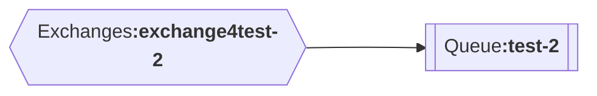
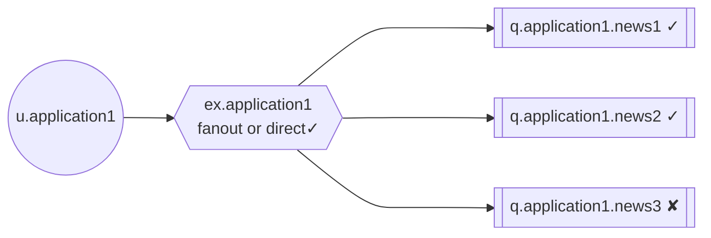
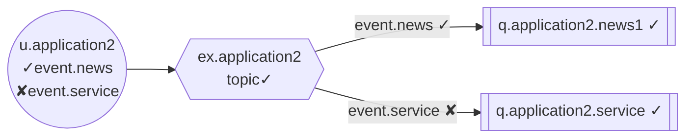

# 10. Security
## RabbitMQ Security
✘ Network security  
✘ Firewalls  
✘ Proper hardware configuration  
✘ Load balancers  
✘ File permissions  
✘ Operation system security  
✓ Information Security

* **Exposing sensitive data (data leak)**   
Messages may contain personal information, credit card numbers, passwords or strictly
confidential data. Use access rights and encryption at-rest. RabbitMQ
does not encrypt messages at-rest. You need to encrypt messages on
producer side and decrypt on consumer side. In transit (SSL/TLS) is
available.
* **System failure**   
Poison message can crash consumers or put them into infinite loop.
More sophisticated techniques may be used for unauthorized access
to other parts of your infrastructure

## Information Security
In 2018 **British Airways** was the victim of an attack
which affected over **400 000 customers** (personal data
and credit card data). **Fee: £183 million** for inadequate
security control.

May 2017 - the largest coordinated ransomware attack by malware
called **WannaCry**. Over **200 000 computers** infected in over **150 countries**. Individuals were forced to pay a ransom to decrypt
encrypted files. Many public health services impacted (outdated
operating systems). Cost is estimated in **many $billions**

In 2017 about 163 milion personal data was stolen (social security numbers,
birth dates, addresses and information used to conduct identity fraud) from
**Equifax**. Cost: over **$1.4 billion** to cover compensations, lawyers, fines and
security investition.


## Information Security Regulations
*  **GDPR (EU)**  
The GDPR aims primarily to give control to individuals over their personal data and to simplify the
regulatory environment for international business by unifying the regulation within the EU
*  **BDSG (Germany)**   
Governs the exposure of personal data, which are manually processed or stored in IT systems
*  **FDPIC (Switzerland)**   
Responsible to advise, educate and ensure the protection of personal data
*  **ICCPR (New Zealand)**  
Right to privacy but it tends to hold the status of a value or an interest, rather than a right

> The same software hosted in different regions may have different architecture due to local regulations

## Information Security in RabbitMQ
* **Permissions (access rights)**
  * Delete guest user or change it’s password
  * Separate user per application
  * Good naming convention
  * Use minimum permissions
* **Messages encryption**
  * At-rest encryption. RabbitMQ does not support at-rest encryption by default.
You must encrypt messages on producer side and decrypt on consumer side.
  * In-transit encryption. Use **SSL/TLS**. Make sure producer, consumer, nodes and
entire clusters use encrypted connections

## Security - Permissions
### Permissions - Core
* **Authentication**  
User can be authenticated via password, X.509 certificate or external system,
* **Authorization**  
Permissions for user are set by **regular expressions** for **configure**, **write** and **read** operations
  * <font color=red> **read** operations on every entity (resource)</font>   
retrieve messages from a resource
  * <font color=red> **write** operations on every entity (resource)</font>    
inject messages into a resource
  * <font color=red> **configure** operations every entity (resource)</font>   
create or destroy resources, or modify their behaviour

> RabbitMQ management plugin uses tagging for authorization (administrator, monitoring, policymaker, management, impersonator)

|AMQP 0-9-1 Operation|           |configure |write| read |
|-----------------|---------------|---------|-----|------|
|exchange.declare |(passive=false)| exchange|     |      |
|exchange.declare |(passive=true)|    |           |      |
|exchange.declare |(with AE)| exchange| exchange (AE)| exchange|
|exchange.delete |          |exchange|
|queue.declare |(passive=false)| queue||
|queue.declare |(passive=true)|||
|queue.declare |(with DLX)| queue| exchange (DLX)| queue|
|queue.delete ||queue||
|exchange.bind |||exchange (destination)| exchange (source)|
|exchange.unbind|||exchange (destination)| exchange (source)|
|queue.bind||| queue| exchange|
|queue.unbind||| queue| exchange|
|basic.publish| ||exchange||
|basic.get|||| queue|
|basic.consume|||| queue|
|queue.purge| |||queue|


### Permissions - Management UI
*  **Management**  
User can access the management plugin (front-end & back-end)
*  **Policymaker**  
User can access the management plugin and manage policies and parameters for the vhosts he
has access to
*  **Monitoring**  
User can access the management plugin and see all connections and channels as well as
node-related information.
*  **Administrator**  
User can do everything. Monitor cluster and metrics, manage users, vhosts and permissions. Close
other user's connections, manage policies and parameters for all vhosts


### Permissions - Topics
In version 3.7.0 RabbitMQ introduced feature called topic permissions. Feature is used by topic exchanges only
to define to what topic user can publish and from what topic user can read messages. It’s an additional layer on
top of existing checks for publishers (all protocols) and consumers (MQTT and STOMP protocols only).

Routing-key is matched against a regular expression to decide whether the message can be routed
downstream or not.

*  <font color=red>**write** to topic</font>   
routing-key of a published message is matched against a regular expression to decide whether the
message can be routed downstream or not)
*  <font color=red>**read** from topic</font>   
for consumers; for the topic-oriented protocols such as MQTT and STOMP (not applies to AMQP)

### RabbitMQ Permissions
General permissions can be granted to:
* <font color=red>**read** operations on every entity (resource)</font>   
retrieve messages from a resource
* <font color=red>**write** operations on every entity (resource)</font>   
inject messages into a resource
* <font color=red>**configure** operations every entity (resource)</font>   
create or destroy resources, or alter their behaviour


Topic permissions (available from version 3.7.0) can be granted to:
*  <font color=red>**write** to topic</font>   
routing-key of a published message is matched against a regular expression to decide whether the
message can be routed downstream or not)
*  <font color=red>**read** from topic</font>   
for consumers; for the topic-oriented protocols such as MQTT and STOMP (not applies to AMQP)

``'^$'``, i.e. matching nothing but the empty string (empty string ``''`` can be used as a synonym)

``'^(amq\.gen.*|amq\.default)$'`` gives a user access to server-generated names and the default exchange

``'^test-.*'`` gives a user access to server-generated
names prefixed by “test-”, but not to default exchange
(not possible to publish messages)

> Define naming convention for
exchanges and queues

<font color=red>Can message be published to test-2 queue?</font>

|Expression         |description| 
|-------------------|---------------| 
|``'^(amq\.default)$'`` |YES (via default exch.)| 
|``'^(amq\.default\|test-.*)$'`` |YES (via default exch.)| 
|``'^(exchange4test.*)$'`` |YES (via exchange4test)|  
|``'^(exchange4test-.*\|test-2)$'`` |YES (via default exch.)| 
|``'^(exchange4test-.*\|test-2)$'`` |YES (via both)| 
|``'^(exchange4test-.*\|test-2\| !amq\.default)$'`` |YES (via exchange4test-2 only)|  


### RabbitMQ Permissions - HandsOn
#### Publish/Consume permissions



#### Topic permissions


## Permissions - Summary
* **Explicitly grant user to exchanges and queues**  
Never leave any permissions widely open. For instance, leaving write permissions widely open allows user
publish messages to any queue using for instance default (nameless) exchange. Good naming convention of
exchanges and queues helps a lot!
* **Minimum permissions (least privilege)**  
Don’t set permissions in advance. When you create permissions, follow the standard security advice of
**granting least privilege**, or granting only the permissions required to perform a task
* **Examples**  
  ``'^$'``, matching nothing but the empty string (empty string ``''`` can be used as a synonym). This regular
expression restricts permissions.
  
  ``'ex\.test1'`` gives a user access to ex.test1 and all names which includes ex.test1

  ``'^(ex\.test1|amq\.default)$'`` gives a user access to ex.test1 and the default exchange

  ``'^(amq\.gen.*|amq\.default|ex\.test[0-9]+| !ex\.test1 )$'`` gives a user access to
server-generated names, the default exchange and all resources prefixed by ex.test and followed by
numbers except ex.test1

### RabbitMQ Users and Permissions
Manage privileges from command line
```bash
> rabbitmqctl add_user <user id> <password>
> rabbitmqctl set_user_tags <user id> administrator
> rabbitmqctl set_permissions -p / <user id> ".*" ".*" ".*"
```
Reuse previous example with topic_logs exchange


