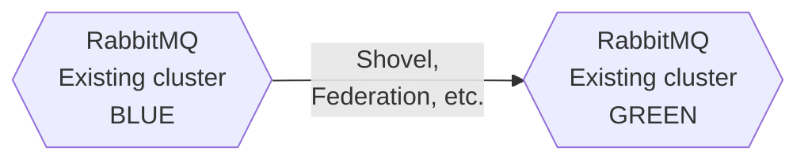

# 11. Maintenance
## Reliable system
### Issues with reliable delivery
Messaging-based systems are distributed by definition and **can fail at any moment**. Node as
well server and client applications can experience **hardware failure** or they can crash due to
**any reason at any time**. Additionally, even if client applications keep running, logic errors can
cause channel leaks or connection errors impacting reliable message delivery. We can
distinguish three groups of possible issues:


1. **Network issues**  
Most common and unpredictable
2. **Hardware issues**  
Less common. They impact RabbitMQ nodes, producers, consumers.
3. **Software issue**  
Bugs or poor code quality 

### 5 points for reliable delivery
1. **Client’s ACKs**   
Only manual ACKs guarantee message consumption
2. **Transactions & Producer Confirms (aka Publisher Confirms)**   
Sending different type of data may require different code logic and different mechanisms like transactions
or publisher conforms or both - use async or bulks together with complex retry logic
3. **Messages to survive server restart**   
Durable exchange, durable queues and persistent messages
4. **Availability**   
RabbitMQ Clustering and Federations with Classic HA queues, Quorum queues or Streams to distribute
messages across nodes
5. **Well designed application logic**   
Depends on the type the data, its volume, size of individual message, daily volume, daily size and the
business requirements. Features like: rejections, alternate exchanges, TTLs, DLX, retry custom logic,
consumer tag tracking etc.

## Backup & Restore
### Backup & Restore
Every RabbitMQ node stores two type of data inside /data directory. Both of them can be backup and
restored separately.
1. **Schema definition (topology)**   
definitions for Users, vhosts, queues, exchanges, bindings, permissions, runtime parameters etc. Definitions
are stored in an internal database and replicated across all nodes in the cluster, so every node has its own
replica of all definitions. Definitions can only be backed up from a running node - active partitions impact
this data in the same way messages in queues
2. **Message store data**   
messages content. Messages can be replicated between nodes (HA queues, Quorum queues, Streams).
Messages can only be backed up from a stopped node (to avoid inconsistent snapshot of the data). When
using HA (mirrored) queues or Quorum queues, entire cluster should be stopped.

> From RabbitMQ 3.7.0.
messages are grouped in
subfolders per virtual host


## Schema Definition Export and Import
All the nodes in the cluster store definitions for Users, vhosts, queues, exchanges, bindings,
permissions, runtime parameters etc. Such group of definitions we call a **Schema Definition** (or just
Schema or Topology). Schema Definitions are stored in an internal database and **replicated across all 
nodes**. Every node in a cluster has its **own replica of all definitions**. When a part of definitions changes,
the update is performed on all nodes in a single transaction. Definitions can be exported from any
cluster node with the same result.

Definitions can be exported to a file and then imported into another cluster or used for schema backup
or resources monitoring purposes.
```bash
> # Does not require management plugin to be enabled, new in RabbitMQ 3.8.2
> rabbitmqctl export_definitions /path/to/definitions.file.json
```

> Use RESTful API alternatively: GET /api/definitions
```bash
> # Requires management plugin to be enabled
> rabbitmqadmin export /path/to/definitions.file.json
```
Definition import can be used for pre-configuring nodes at deployment time.
Manual import:
```bash
> # Does not require management plugin to be enabled, new in RabbitMQ 3.8.2
> rabbitmqctl import_definitions /path/to/definitions.file.json
```
```bash
> # Requires management plugin to be enabled
> rabbitmqadmin import /path/to/definitions.file.json
```

When node boots (in rabbitmq.conf file):
```bash
# Does not require management plugin to be enabled, new in RabbitMQ 3.8.2
load_definitions = /path/to/definitions/file.json
# Requires management plugin to be enabled at the time of node boot
management.load_definitions = /path/to/definitions/file.json
```

### Messages Export and Import
Make a copy of ``“message store data”`` pointed by **RABBITMQ_MNESIA_DIR**. While restoring, make sure
schema definitions are already imported

## Upgrade
### RabbitMQ Upgrade
1. In-place upgrade  
Upgrade node by node with existing data on the disk
2. Blue-Green  
Create new cluster and migrate existing data

|              |In-place|Blue-Green|
|---------------|-------|----------| 
|Risk of failure|High   |Low       |
|Extra hardware |n/a    |Yes       | 

### RabbitMQ In-place upgrade
1. Prepare
   * Check **version compatibility**,
   * **Erlang version** requirements,
   * Release notes,
   * Features that do not support in-place upgrades, and known caveats.
   * Make sure there are no ongoing synchronisation operations (i.e. HA queues), no alarms -
generally node has to be in good shape.
2. Backup & Stop the node
3. Upgrade files
   * Upgrade RabbitMQ + Erlang
4. Start node

### RabbitMQ Blue-Green upgrade
Safer, but more costly approach.
Data can be copied in various ways - the easiest one is to configure Shovel or Federation.


## Tuning
### Tuning
1. **Review queues configuration**  
Consider lazy queues, keep queues short (if possible), use TTL etc.
2. **Review architecture**   
Review publishers and consumers (i.e enable NIO, change frame size, prefetch, use
transient messages over persistent, use multiple queues and customers, not to use
manual acks and publisher confirms), more nodes, replication, network etc.
3. **Play with configuration**   
Disable plugins you are not using, review features used by RabbitMQ (CPU/MEM). Most
popular quick-wins as well deprecated approaches are on the next slides.

> Queues are single-threaded in RabbitMQ. Use
multiple queues and customers

> Persistent messages are written to disk as soon
as they arrive. Use transient messages to
increase the throughput.

### Tuning - config
**HiPE** support (High-Performance Erlang) has been dropped in Erlang 22. RabbitMQ no longer supports HiPE
precompilation.

There were various opinion about enabling HiPE to speed up RabbitMQ. Fact that HiPE has been officially
dropped, menas we should not take this option into account while tuning our cluster.

```
hipe_compile=true
```
By default the RabbitMQ emits metrics events every 5 seconds. The message rate values
shown in the management plugin are calculated over this period.
- Increase the statistics interval to i.e. 30s
- Eventually disable message rates calculation for Management plugin

Both above reduce CPU consumption.

```
management.rates_mode = none
collect_statistics_interval = 30000
```
```
> rabbitmqctl eval 'application:set_env(rabbit, collect_statistics_interval, 30000).'
```
### Tuning - maintenance
Prior to version 3.6.7 stats database was stored on a single node. Starting from version 3.6.7, each node has its
own statistics database. The statistics database is stored in the memory, so to save some RAM, it can be reset
from time to time.
* RabbitMQ < 3.6.2
  ```bash
  > rabbitmqctl eval 'exit(erlang:whereis(rabbit_mgmt_db), please_terminate).'
  ```
* RabbitMQ > 3.6.2 and RabbitMQ < 3.6.7
  ```bash
  > rabbitmqctl eval 'supervisor2:terminate_child(rabbit_mgmt_sup_sup, rabbit_mgmt_sup), rabbit_mgmt_sup_sup:start_child().'
  ```
* RabbitMQ >= 3.6.7 (current node)
  ```bash
  > rabbitmqctl eval 'rabbit_mgmt_storage:reset().'
  ```
* RabbitMQ >=3.6.2 (all nodes)
  ```bash
  > rabbitmqctl eval 'rabbit_mgmt_storage:reset_all().'
  ```

> Use RESTful API alternatively:  
> * DELETE /api/reset
> * DELETE /api/reset/:node

### Tuning - config
When node starts, up to 16384 messages are loaded into RAM from the every single queue
(including lazy queues).

Deep dive: 16384 messages < 4096 bytes are loaded into RAM from each queue
- Decrease value from 4096 (default) to reasonable smaller value, i.e. 512 bytes
  ```
  queue_index_embed_msgs_below = 512
  ```
When messages are big, increase frame_size
  ```
  frame_size = 1000000  
  ```
### Tuning - queue configuration
Quorum Queues store content on disk (per Raft requirements) as well in memory by default,
use:
* x-max-in-memory-length
* x-max-in-memory-bytes

to limit.

1. deprecated:  RabbitMQ 3.10 and newer
2. approved:  RabbitMQ 3.9.x and earlier

### Tuning - applications, config
We need to make sure our applications are well designed (both producers and consumers). Most common
issue is wrong connection/channels usage
1. **Use long-lived connections and reasonable number of connections**  
Establishing connection is time consuming. Avoid “High Churn” issues. Issues with batch scripts, PHP
etc. Too many connections = waste of resources on both sides (RabbitMQ and App).
2. **Separate connection for publisher and consumer**  
Sometimes the same process acts as a publisher and consumer. When too many messages are being
produced, server might not receive the acknowledgments from the client = lower consume speed +
server will be overloaded
3. **Don’t share channels between threads**   
Channel consumes a relatively small amount of memory on the client size in comparison to
connection.. Share connection if needed, but use one channel per thread in your application

```
channel_max = 2047
connection_max = infinity
```

### Tuning - applications
We need to make sure our applications are well designed (both producers and consumers).
Most common issues with queues
1. **Use relatively small queues**  
Avoid too long queues (number of messages)and too big queues (in terms of bytes).
Long queues increase memory usage, sync time between nodes, increase node start
time. Management interface collects and stores more stats. Use multiple queues instead
of single huge one.
2. **Use valid queue attributes (adopt queue attr to business requirements)**  
Lazy queues, auto-delete, durability, TTL, max-length etc.
3. **Make sure to use up-to-date versions**   
Keep RabbitMQ and Erlang up-to-date

### Tuning - config
Increase ``RABBITMQ_IO_THREAD_POOL_SIZE`` (default is 128) when many CPUs are available
Increase ``RABBITMQ_MAX_NUMBER_OF_PROCESSES`` (default is 1mln) when more than
hundreds of queues or in environment with high number of connections